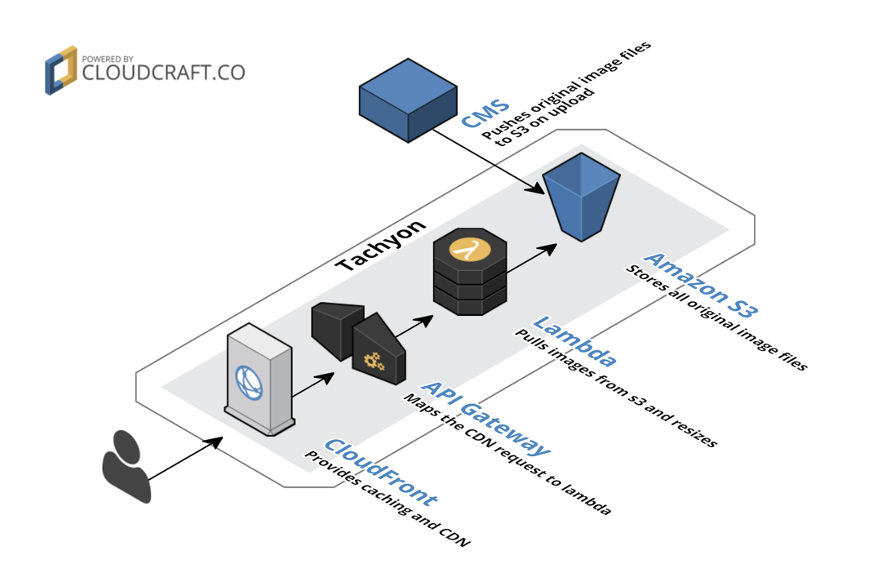
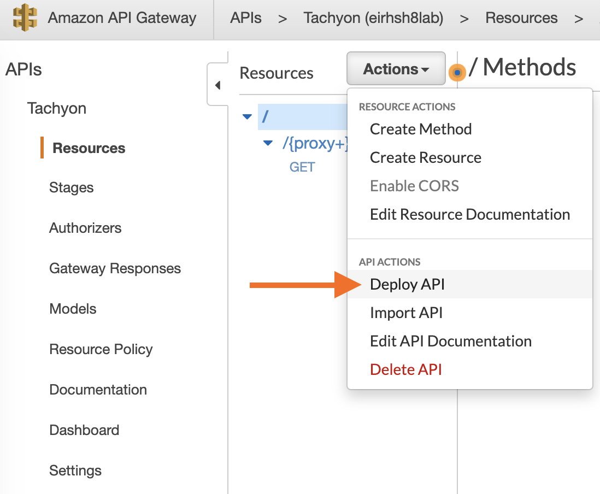

<table width="100%">
	<tr>
		<td align="left" colspan="2">
			<strong>Tachyon</strong> 
			Faster than light image resizing service that runs on AWS. Super simple to set up, highly available and very performant.
		</td>
	</tr>
	<tr>
		<td>
			A <strong><a href="https://hmn.md/">Human Made</a></strong> project. Maintained by @joehoyle.
		</td>
		<td align="center">
			
		</td>
	</tr>
</table>

Tachyon is built with some strong opinions and assumptions:

- Runs on AWS (using CloudFront, Lambda and API Gateway.)
- Expects original image files to be stored on Amazon S3.
- Only supports simple image resizing, not a full image manipulation service.

Tachyon works best with WordPress, coupled with [S3 Uploads](https://github.com/humanmade/s3-uploads) and the [Tachyon Plugin](https://github.com/humanmade/tachyon-plugin).

**[View Documentation →](docs/README.md)**

## Documentation

**[View Documentation →](docs/README.md)**

### Setup

Tachyon comes in two parts: the [server to serve images](docs/server.md), and the [plugin to use it](docs/plugin.md). To use Tachyon, you need to run at least one server, as well as the plugin on all sites you want to use it.

The server is also available as a [Docker image](docs/docker.md), which can be used in production or to set up a local test environment.

## Using

Tachyon provides a simple HTTP interface in the form of:

`https://{tachyon-domain}/my/image/path/on/s3.png?w=100&h=80`

It's really that simple!

**[View Args Reference →](docs/using.md)**

### Upgrading

When upgrading, be sure to perform an API Gateway deployment from the AWS Console. Navigate to API Gateway from the AWS Console and select the "Tachyon" API. Once selected, click "Actions" and then "Deploy API."

## Credits

Created by Human Made for high volume and large-scale sites. We run Tachyon on sites with millions of monthly page views, and thousands of sites.

Written and maintained by [Joe Hoyle](https://github.com/joehoyle).

Tachyon is inspired by Photon by Automattic. As Tachyon is not an all-purpose image resizer, rather it uses a media library in Amazon S3, it has a different use case to [Photon](https://jetpack.com/support/photon/).

Tachyon uses the [Sharp](https://github.com/lovell/sharp) (Used under the license Apache License 2.0) Node.js library for the resizing operations, which in turn uses the great libvips library.

Interested in joining in on the fun? [Join us, and become human!](https://hmn.md/is/hiring/)
