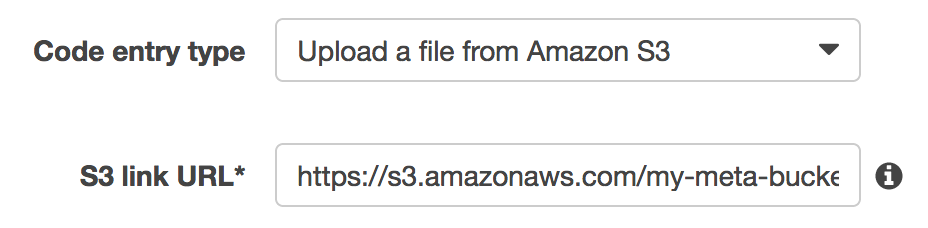
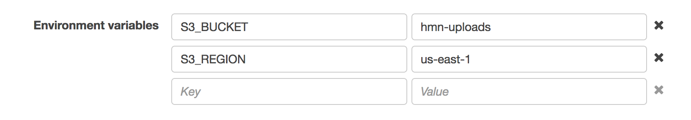

# Server Setup

The Tachyon server is responsible for generating and serving images.

It can be installed [using AWS CloudFormation](#installation-on-aws), [manually on AWS Lambda](#manual-installation-on-lambda), or [manually using Node.js](#manual-installation). Alternatively, you can use [the Docker installation](docker.md).


# Installation on AWS

We highly recommend using Tachyon on [AWS Lambda](https://aws.amazon.com/lambda/details/) to offload image processing task in a serverless configuration. This ensures you don't need lots of hardware to handle thousands of image resize requests, and can scale essentially infinitely. One Tachyon stack is required per S3 bucket, so we recommend using a common region bucket for all sites, which then only requires a single Tachyon stack per region.

[CloudFormation](https://aws.amazon.com/cloudformation/) is the easy way to provision and set up Lambda, and includes the configuration for [CloudFront](https://aws.amazon.com/cloudfront/) and [API Gateway](https://aws.amazon.com/api-gateway/) to make your Lambda function available.

Setting up Tachyon using CloudFormation is a three-step process.


## Step 1: Creating Prerequisites

Before provisioning Tachyon itself, you need to first upload Tachyon to an S3 bucket. This needs to be accessible by Lambda, and you need to note the bucket and key (path) for use during CloudFormation provisioning.

You also need to create an SSL certificate in [Amazon Certificate Manager](https://aws.amazon.com/certificate-manager/) for the domain(s) you're using. CloudFormation does not provision this, to allow for use of existing certificates.

**Important Note:** Due to [AWS limitations](http://docs.aws.amazon.com/AWSCloudFormation/latest/UserGuide/aws-properties-cloudfront-distributionconfig-viewercertificate.html#cfn-cloudfront-distributionconfig-viewercertificate-acmcertificatearn), this certificate **must be created in us-east-1**.


## Step 2: Creating CloudFormation Stack

The next step is creating the CloudFormation stack. This provisions all the necessary resources to run Tachyon, and configures them to all work well with each other.

The CloudFormation template is [available in the GitHub repository](https://github.com/humanmade/tachyon/blob/master/cloudformation-template.json) and can be uploaded directly through the AWS Console, or uploaded to an S3 bucket.

This needs to be configured with all the necessary details:

* `NodeTachyonBucket`: The bucket you uploaded Tachyon to in Step 1. (e.g. `my-meta-bucket`)
* `NodeTachyonLambdaPath`: The key (path) you uploaded Tachyon to in Step 1. (e.g. `lambda/node-tachyon/lambda-nodejs4.3.zip`)
* `SSLACMCertificateARN`: ARN for SSL certificate to use from Amazon Certificate Manager.
* `Domains`: Comma-separated list of domains to attach to this Tachyon instance. (e.g. `us-east-1.tchyn.io`)
* `UploadsS3Bucket`: Bucket to serve uploads from. (e.g. `my-uploads-bucket`)

Once you've configured the stack, wait for it to provision. This is usually quite slow, as CloudFront can take up to an hour to provision.


## Step 3: Tweak API Gateway

Currently, API Gateway does not support setting the method into binary mode (required for images) via CloudFormation. This means we need to tweak it after the stack has been created.

Open the AWS Console, head to API Gateway, and select the newly created <kbd>Tachyon</kbd>, then the <kbd>Binary Support</kbd> item. Set this to `image/*`.

Save, and once the changes have been applied, Tachyon should be fully configured for your domain.


# Manual Installation on Lambda

Tachyon can also be manually installed on Lambda, however you will need to handle triggering the Lambda function yourself. This can be done via EC2 instances or another reverse proxy as required.

Simply upload Tachyon to S3 per Step 1 above, then create a new Lambda function with this path set.



Select Node 4.3 for the environment. Tachyon requires the S3 bucket and region to be configured as Environment Variables, with the keys `S3_BUCKET` and `S3_REGION` (these can be changed after creation if required).



Configure the rest of your Lambda function as desired.


# Manual Installation

If desired, Tachyon can be run on your own servers using Node 4.3. This can also be used for local installations during development.

libvips must be installed on the system as a requirement for sharp. Under Linux, this is built automatically when installing `node_modules`. If you're running on OSX, the easiest way to install libvips is to use homebrew:

```
brew install homebrew/science/vips --with-webp --with-graphicsmagick
```

Clone and initialise the repo, including node modules:

```
git clone git@github.com:humanmade/node-tachyon.git
npm install
```


## Configuration

Populate the `config.json` with the AWS region and bucket name you want to use, in the following format:

```json
{
	"region": "eu-west-1",
	"bucket": "hmn-uploads-eu"
}
```

These can also be passed via the `AWS_REGION`, and `AWS_S3_BUCKET` environment variables if required.


## Running the server

```
node server.js [port] [--debug]
```

With no options passed you should see the server running by default on `http://localhost:8080/` - this is your Tachyon URL, which you need to configure [when installing the plugin](plugin.md).
